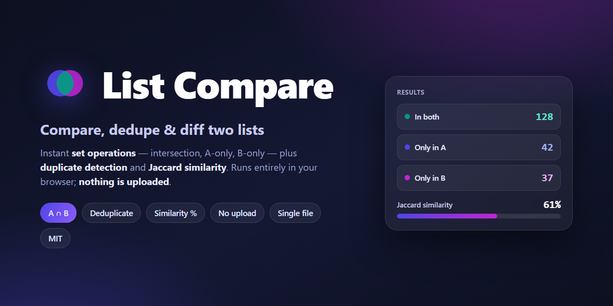
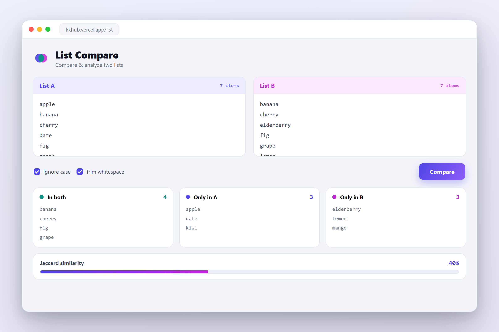

<p align="center">
  
</p>

<h1 align="center">List Compare</h1>

<p align="center">
  <b>Compare, dedupe & diff two lists — right in your browser.</b><br>
  Set operations (A ∩ B, A-only, B-only), duplicate detection, and Jaccard similarity.<br>
  Fast, private, zero-upload, and a single HTML file with no dependencies.
</p>

<p align="center">
  <a href="https://kkhub.vercel.app/list"><b>▶ Live demo</b></a> ·
  <a href="#features">Features</a> ·
  <a href="#usage">Usage</a> ·
  <a href="#privacy">Privacy</a>
</p>

---

Paste two lists and instantly see how they overlap: what's **in both**, what's **only in A**, what's
**only in B**, the **duplicates** inside each, and an overall **similarity score**. Everything runs
locally in your browser — your lists are never uploaded anywhere.

<p align="center">
  
</p>

## Features

- **Set operations** — intersection (**A ∩ B**), **A-only**, **B-only**, and union, computed live.
- **Deduplicate** — collapse repeats within a list, and surface the **duplicate** entries.
- **Similarity** — unique counts per list, items in common, and **Jaccard similarity %**.
- **Normalization** — ignore case and trim whitespace so "  Apple" and "apple" match when you want.
- **Sort / shuffle / swap** — reorder either list, or swap A ↔ B in one click.
- **Import & export** — drag-and-drop a `.txt` file onto a list; **download** any result as `.txt`; one-click copy.
- **Autosave** — your lists are remembered locally (localStorage) between visits.
- **Keyboard** — <kbd>Ctrl</kbd>/<kbd>⌘</kbd> + <kbd>Enter</kbd> to compare.
- **Light & dark theme**, responsive down to phone width.

## Usage

1. Open the [live demo](https://kkhub.vercel.app/list) (or `index.html` locally).
2. Paste your first list into **A** and your second into **B** (one item per line).
3. Toggle **ignore case** / **trim** if you want loose matching, then **Compare**.
4. Read the results — **in both**, **only in A**, **only in B**, **duplicates**, **similarity** — and
   copy or download any of them.

## Privacy

**Nothing leaves your device.** There is no server, no backend, no analytics beacon, and no network
request with your data. All comparison happens in JavaScript in your browser, and your lists are stored
only in your own browser's `localStorage`. You can read every line of the code — it's one file.

## Run it locally

It's a **single, self-contained HTML file** — no build step, no `npm install`, no dependencies:

```bash
git clone https://github.com/kktheglider/ListCompare.git
cd ListCompare
# then just open index.html in any browser (or serve the folder)
python -m http.server 8000    # optional: http://localhost:8000
```

## Deploy

Because it's one static file, host it **anywhere**: GitHub Pages, Vercel, Netlify, Cloudflare Pages,
S3, or your own server — just publish `index.html`. (The live demo runs on Vercel.)

## Tech

Vanilla **HTML + CSS + JavaScript**, no framework and no dependencies (Inter / JetBrains Mono web
fonts are the only external assets). ~34 KB, works offline once loaded.

## License

MIT — see [LICENSE](LICENSE).
